# Image Super-Resolution via Iterative Refinement

[Paper](https://arxiv.org/pdf/2104.07636.pdf ) |  [Project](https://iterative-refinement.github.io/ )

## Brief

This is an unofficial implementation of **Image Super-Resolution via Iterative Refinement(SR3)** by **Pytorch**.

There are some implement details with paper description, which may be different from the actual `SR3` structure due to details missing.

- We used the ResNet block and channel concatenation style like vanilla `DDPM`.
- We used the attention mechanism in low-resolution features(16×16) like vanilla `DDPM`.
- We encode the $\gamma$ as `FilM` structure did in `WaveGrad`, and embed it without affine transformation.
- We define posterior variance as $ \dfrac{1-\gamma_{t-1}}{1-\gamma_{t}}  \beta_t $  rather than $\beta_t$,  which have the similar results in vanilla paper.

**If you just want to upscale `64x64px` -> `512x512px` images using the pre-trained model, check out [this google colab script](https://colab.research.google.com/drive/1G1txPI1GKueKH0cSi_DgQFKwfyJOXlhY?usp=sharing).**

## Status

**★★★ NEW: Its follow-up [Palette-Image-to-Image-Diffusion-Models](https://arxiv.org/abs/2111.05826) is now available; See the details [here](https://github.com/Janspiry/Palette-Image-to-Image-Diffusion-Models) ★★★**

### Conditional generation(super resolution)

- [x] 16×16 -> 128×128 on FFHQ-CelebaHQ
- [x] 64×64 -> 512×512 on FFHQ-CelebaHQ

### Unconditional generation

- [x] 128×128 face generation on FFHQ
- [ ] ~~1024×1024 face generation by a cascade of 3 models~~

### Training Step

- [x] log / logger
- [x] metrics evaluation
- [x] multi-gpu support
- [x] resume training / pretrained model
- [x] validate alone script
- [x] [Weights and Biases Logging](https://github.com/Janspiry/Image-Super-Resolution-via-Iterative-Refinement/pull/44) 🌟 NEW


## Results

*Note:*  We set the maximum reverse steps budget to 2000 now. Limited to model parameters in `Nvidia 1080Ti`, **image noise** and **hue deviation** occasionally appear in high-resolution images, resulting in low scores.  There is a lot of room to optimization.  **Welcome to any contributions for more extensive experiments and code enhancements.**

| Tasks/Metrics        | SSIM(+) | PSNR(+) | FID(-)  | IS(+)   |
| -------------------- | ----------- | -------- | ---- | ---- |
| 16×16 -> 128×128 | 0.675       | 23.26    | - | - |
| 64×64 -> 512×512     | 0.445 | 19.87 | - | - |
| 128×128 | - | - | | |
| 1024×1024 | - | - |      |      |

- #### 16×16 -> 128×128 on FFHQ-CelebaHQ [[More Results](https://drive.google.com/drive/folders/1Vk1lpHzbDf03nME5fV9a-lWzSh3kMK14?usp=sharing)]

| 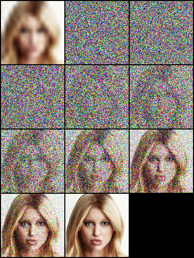 |  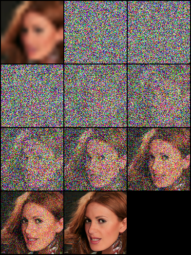    |   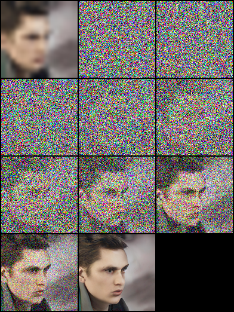   |
| ------------------------------------------------------------ | ---- | ---- |

- #### 64×64 -> 512×512 on FFHQ-CelebaHQ [[More Results](https://drive.google.com/drive/folders/1yp_4xChPSZUeVIgxbZM-e3ZSsSgnaR9Z?usp=sharing)]

|  | 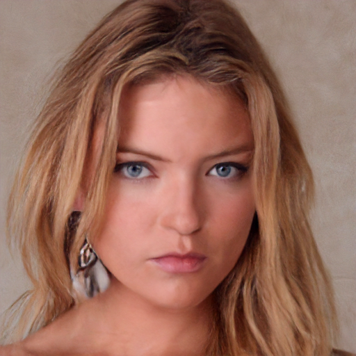 | 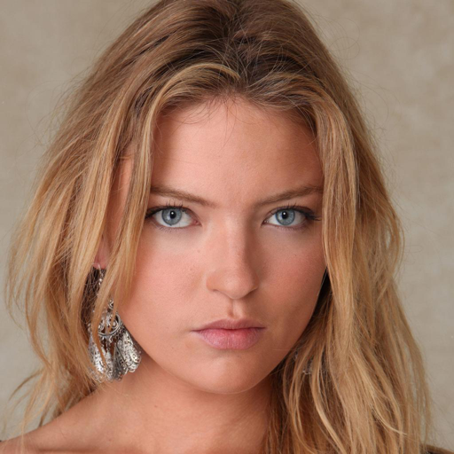 |
| ------------------------------------------------------------ | ------------------------------------------------------------ | ------------------------------------------------------------ |
| 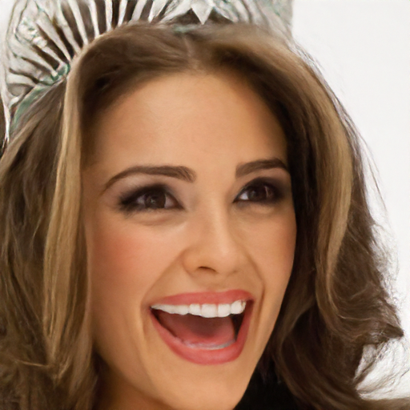 | 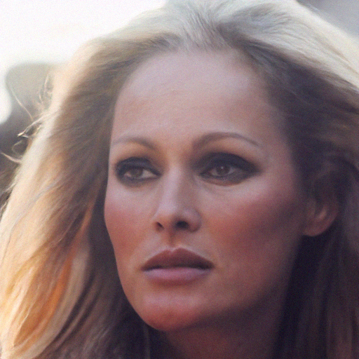 | 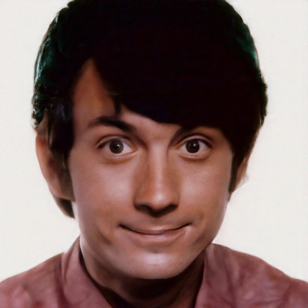 |

- #### 128×128 face generation on FFHQ [[More Results](https://drive.google.com/drive/folders/13AsjRwDw4wMmL0bK7wPd2rP7ds7eyAMh?usp=sharing)]

| 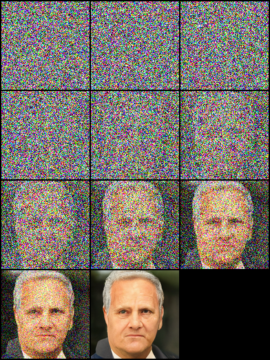 |  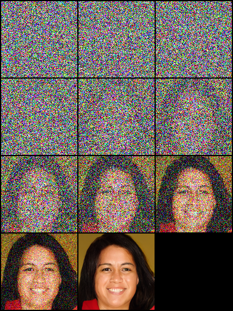    |   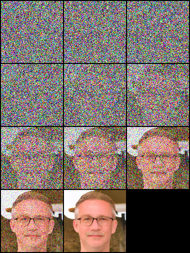   |
| ------------------------------------------------------------ | ---- | ---- |


## Usage
### Environment
```python
pip install -r requirement.txt
```

### Pretrained Model

This paper is based on "Denoising Diffusion Probabilistic Models", and we build both DDPM/SR3 network structures, which use timesteps/gama as model embedding input, respectively. In our experiments, SR3 model can achieve better visual results with the same reverse steps and learning rate. You can select the JSON files with annotated suffix names to train the different models.

| Tasks                             | Platform（Code：qwer)                                        | 
| --------------------------------- | ------------------------------------------------------------ |
| 16×16 -> 128×128 on FFHQ-CelebaHQ | [Google Drive](https://drive.google.com/drive/folders/12jh0K8XoM1FqpeByXvugHHAF3oAZ8KRu?usp=sharing)\|[Baidu Yun](https://pan.baidu.com/s/1OzsGZA2Vmq1ZL_VydTbVTQ) |  
| 64×64 -> 512×512 on FFHQ-CelebaHQ | [Google Drive](https://drive.google.com/drive/folders/1mCiWhFqHyjt5zE4IdA41fjFwCYdqDzSF?usp=sharing)\|[Baidu Yun](https://pan.baidu.com/s/1orzFmVDxMmlXQa2Ty9zY3g) |   
| 128×128 face generation on FFHQ   | [Google Drive](https://drive.google.com/drive/folders/1ldukMgLKAxE7qiKdFJlu-qubGlnW-982?usp=sharing)\|[Baidu Yun](https://pan.baidu.com/s/1Vsd08P1A-48OGmnRV0E7Fg ) | 

```python
# Download the pretrain model and edit [sr|sample]_[ddpm|sr3]_[resolution option].json about "resume_state":
"resume_state": [your pretrain model path]
```

### Data Prepare

#### New Start

If you didn't have the data, you can prepare it by following steps:

- [FFHQ 128×128](https://github.com/NVlabs/ffhq-dataset) | [FFHQ 512×512](https://www.kaggle.com/arnaud58/flickrfaceshq-dataset-ffhq)
- [CelebaHQ 256×256](https://www.kaggle.com/badasstechie/celebahq-resized-256x256) | [CelebaMask-HQ 1024×1024](https://drive.google.com/file/d/1badu11NqxGf6qM3PTTooQDJvQbejgbTv/view)

Download the dataset and prepare it in **LMDB** or **PNG** format using script.

```python
# Resize to get 16×16 LR_IMGS and 128×128 HR_IMGS, then prepare 128×128 Fake SR_IMGS by bicubic interpolation
python data/prepare_data.py  --path [dataset root]  --out [output root] --size 16,128 -l
```

then you need to change the datasets config to your data path and image resolution: 

```json
"datasets": {
    "train": {
        "dataroot": "dataset/ffhq_16_128", // [output root] in prepare.py script
        "l_resolution": 16, // low resolution need to super_resolution
        "r_resolution": 128, // high resolution
        "datatype": "lmdb", //lmdb or img, path of img files
    },
    "val": {
        "dataroot": "dataset/celebahq_16_128", // [output root] in prepare.py script
    }
},
```

#### Own Data

You also can use your image data by following steps, and we have some examples in dataset folder.

At first, you should organize the images layout like this, this step can be finished by `data/prepare_data.py` automatically:

```shell
# set the high/low resolution images, bicubic interpolation images path 
dataset/celebahq_16_128/
├── hr_128 # it's same with sr_16_128 directory if you don't have ground-truth images.
├── lr_16 # vinilla low resolution images
└── sr_16_128 # images ready to super resolution
```

```python
# super resolution from 16 to 128
python data/prepare_data.py  --path [dataset root]  --out celebahq --size 16,128 -l
```

*Note: Above script can be used whether you have the vanilla high-resolution images or not.*

then you need to change the dataset config to your data path and image resolution: 

```json
"datasets": {
    "train|val": { // train and validation part
        "dataroot": "dataset/celebahq_16_128",
        "l_resolution": 16, // low resolution need to super_resolution
        "r_resolution": 128, // high resolution
        "datatype": "img", //lmdb or img, path of img files
    }
},
```

### Training/Resume Training

```python
# Use sr.py and sample.py to train the super resolution task and unconditional generation task, respectively.
# Edit json files to adjust network structure and hyperparameters
python sr.py -p train -c config/sr_sr3.json
```

### Test/Evaluation

```python
# Edit json to add pretrain model path and run the evaluation 
python sr.py -p val -c config/sr_sr3.json

# Quantitative evaluation alone using SSIM/PSNR metrics on given result root
python eval.py -p [result root]
```

### Inference Alone

Set the  image path like steps in `Own Data`, then run the script:

```python
# run the script
python infer.py -c [config file]
```

## Weights and Biases 🎉

The library now supports experiment tracking, model checkpointing and model prediction visualization with [Weights and Biases](https://wandb.ai/site). You will need to [install W&B](https://pypi.org/project/wandb/) and login by using your [access token](https://wandb.ai/authorize). 

```
pip install wandb

# get your access token from wandb.ai/authorize
wandb login
```

W&B logging functionality is added to `sr.py`, `sample.py` and `infer.py` files. You can pass `-enable_wandb` to start logging.

- `-log_wandb_ckpt`: Pass this argument along with `-enable_wandb` to save model checkpoints as [W&B Artifacts](https://docs.wandb.ai/guides/artifacts). Both `sr.py` and `sample.py` is enabled with model checkpointing. 
- `-log_eval`: Pass this argument along with `-enable_wandb` to save the evaluation result as interactive [W&B Tables](https://docs.wandb.ai/guides/data-vis). Note that only `sr.py` is enabled with this feature. If you run `sample.py` in eval mode, the generated images will automatically be logged as image media panel. 
- `-log_infer`: While running `infer.py` pass this argument along with `-enable_wandb` to log the inference results as interactive W&B Tables. 

You can find more on using these features [here](https://github.com/Janspiry/Image-Super-Resolution-via-Iterative-Refinement/pull/44). 🚀


## Acknowledge

Our work is based on the following theoretical works:

- [Denoising Diffusion Probabilistic Models](https://arxiv.org/pdf/2006.11239.pdf)
- [Image Super-Resolution via Iterative Refinement](https://arxiv.org/pdf/2104.07636.pdf)
- [WaveGrad: Estimating Gradients for Waveform Generation](https://arxiv.org/abs/2009.00713)
- [Large Scale GAN Training for High Fidelity Natural Image Synthesis](https://arxiv.org/abs/1809.11096)

and we are benefiting a lot from the following projects:

- https://github.com/bhushan23/BIG-GAN
- https://github.com/lmnt-com/wavegrad
- https://github.com/rosinality/denoising-diffusion-pytorch
- https://github.com/lucidrains/denoising-diffusion-pytorch
- https://github.com/hejingwenhejingwen/AdaFM


